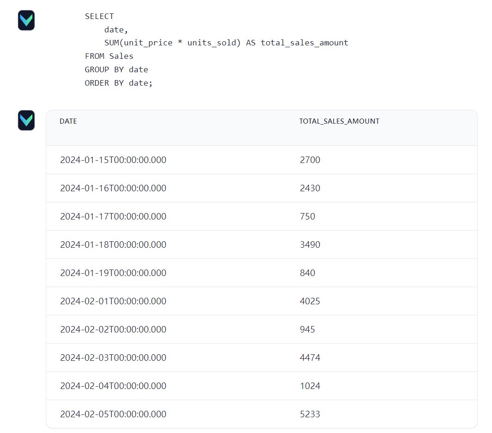
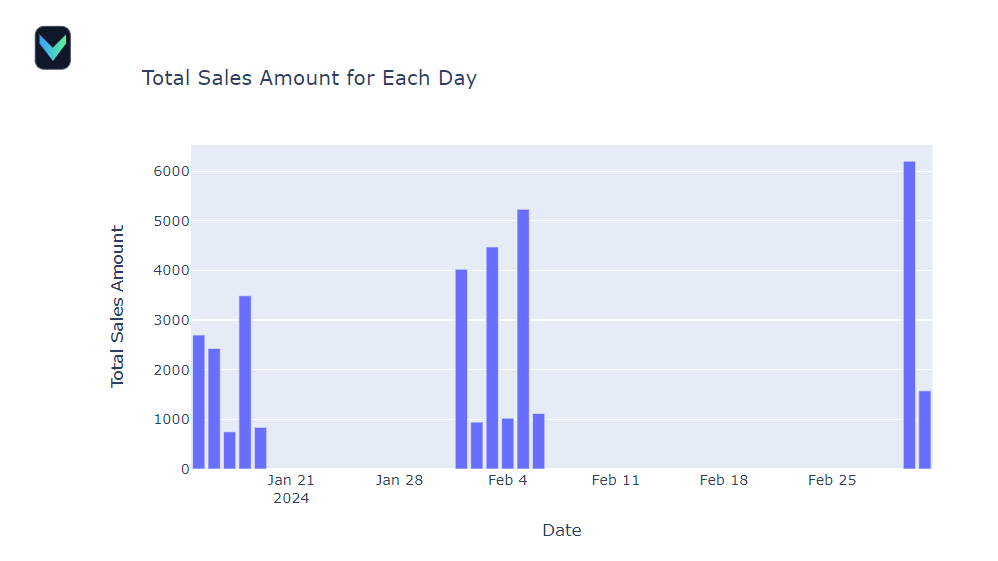
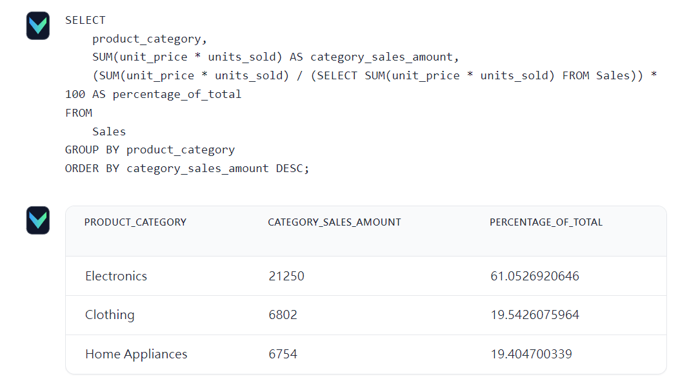
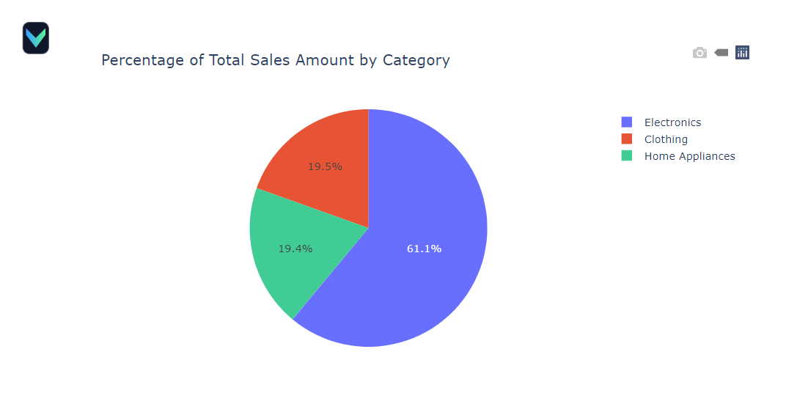

# Vanna AI Flask Sales

將 Vanna AI 連接到 PostgreSQL 資料庫，並使用資料庫中的資料對 AI 進行微調，最後使用 Flask 作為前端網頁。  
Vanna AI 不僅可以根據資料格式撰寫 SQL 查詢，還能直接從資料庫中提取資料，並生成圖表。  
也提供 [init_postgres.sql](init_postgres.sql) 做為我的專案的範例資料。  


## Overview
- AI: Vanna AI v0.6.3
- Database: PostgreSQL v13.2
- Web FrameWork: Flask


## ENV

將 .env.example 複製成 .env  
`VANNA_MODEL` 和 `VANNA_API_KEY` 可以從 [Vanna AI Office WebSite](https://vanna.ai/) 取得  

```yaml
VANNA_MODEL=
VANNA_API_KEY=
PG_HOST=localhost
PG_DBNAME=postgres
PG_USER=postgres
PG_PASSWORD=password
PG_PORT=5432
```


## Run

### Install dependencies
```
pip install vanna
pip install psycopg2
pip install python-dotenv
```

### Run
```
python run.py
```

## UI

```
http://localhost:8084
```

### Total Sales Amount For Each Day




### Percentage Of Total Sales Amount By Category



